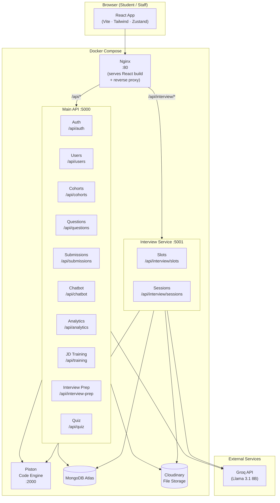

# PlacementPro

An AI-powered placement preparation platform for engineering colleges. It connects students and staff through intelligent learning tools — AI-generated quizzes, mock interviews, JD-based training campaigns, coding practice, and personalised interview prep roadmaps.

---

## Table of Contents

1. [Architecture](#architecture)
2. [Tech Stack](#tech-stack)
3. [Features](#features)
   - [Authentication & Onboarding](#1-authentication--onboarding)
   - [AI Chatbot](#2-ai-chatbot)
   - [Learning Modules](#3-learning-modules)
   - [Coding Practice & Assessment](#4-coding-practice--assessment)
   - [Mock Interviews](#5-mock-interviews)
   - [JD-based Interview Prep (Student)](#6-jd-based-interview-prep-student)
   - [Staff JD Training Assignment](#7-staff-jd-training-assignment)
   - [AI Quiz System](#8-ai-quiz-system)
   - [Dashboards & Analytics](#9-dashboards--analytics)
4. [Project Structure](#project-structure)
5. [Environment Variables](#environment-variables)
6. [Running with Docker](#running-with-docker)
7. [Running Locally (Development)](#running-locally-development)
8. [Seeding the Database](#seeding-the-database)
9. [API Reference](#api-reference)

---

## Architecture



### Request Flow

```
Browser
  │
  ▼
Nginx :80
  ├─ /api/interview/* ──► Interview Service :5001
  └─ /api/*           ──► Main API          :5000
                               │
                    ┌──────────┼──────────────┐
                    ▼          ▼              ▼
               MongoDB     Cloudinary       Groq
                                            (AI)
                              ▲
                    Piston :2000
                (Code Execution)
```

---

## Tech Stack

| Layer                 | Technology                                             |
| --------------------- | ------------------------------------------------------ |
| **Frontend**          | React 18, Vite, Tailwind CSS, Zustand, React Router v6 |
| **UI Components**     | Lucide React, Recharts, Monaco Editor                  |
| **Main Backend**      | Node.js, Express, Mongoose (MongoDB)                   |
| **Interview Service** | Node.js, Express, Mongoose                             |
| **AI / LLM**          | Groq API — Llama 3.1 8B Instant                        |
| **Code Execution**    | Piston (self-hosted, sandboxed)                        |
| **File Storage**      | Cloudinary (resumes, JD PDFs, recordings)              |
| **PDF Parsing**       | pdf-parse                                              |
| **Authentication**    | JWT (access + refresh tokens)                          |
| **Containerisation**  | Docker, Docker Compose, Nginx                          |
| **Database**          | MongoDB Atlas                                          |

---

## Features

### 1. Authentication & Onboarding

**Who:** Students and Staff

- Register with a college email address (domain validated against `COLLEGE_EMAIL_DOMAIN`).
- Roles: `student`, `staff`, `admin`.
- JWT-based authentication using short-lived access tokens (15 min) and long-lived refresh tokens (7 days).
- On first login, students are prompted to select a **learning domain (cohort)** before accessing the dashboard.

**Usage:**

1. Go to `/register` → fill in name, email, password, department, roll number.
2. Log in at `/login`.
3. Students are redirected to domain selection if no cohort is set.

---

### 2. AI Chatbot

**Who:** Students

A context-aware assistant powered by Groq (Llama 3.1 8B) available at all times via the sidebar.

- Ask placement-related questions, request topic explanations, get interview tips.
- Each user has their own session history.

**Usage:** Click **Chatbot** in the sidebar → type your question.

---

### 3. Learning Modules

**Who:** Students

- Modules are grouped by cohort/domain.
- Each module contains learning material and tracks completion.
- Students can navigate to `/modules` to browse all modules in their cohort.

---

### 4. Coding Practice & Assessment

**Who:** Students

**Practice (`/practice`):**

- Browse a question bank filtered by topic and difficulty.
- Write code in the Monaco editor (supports Python, Java, C++, C, JavaScript).
- Code is executed securely via the **Piston** sandboxed engine.
- Real-time output, error messages, and test case evaluation.

**Assessment (`/assessment`):**

- Timed coding tests.
- Submissions are automatically graded by running against hidden test cases in Piston.
- Scores and submission history tracked per student.

**Supported Languages:**

| Language   | Piston Runtime |
| ---------- | -------------- |
| Python     | python 3.12    |
| JavaScript | node 20.x      |
| Java       | java 15        |
| C++        | gcc (g++)      |
| C          | gcc            |

---

### 5. Mock Interviews

**Who:** Students and Staff

**Scheduling (`/schedule-interview`):**

- Staff creates interview slots with date, time, and topic.
- Students book available slots.

**Conducting (`/mock-interview/:sessionId`):**

- AI-driven interview via the Interview Service.
- **Speech-to-Text:** Browser Web Speech API captures student answers.
- **Text-to-Speech:** Browser Speech Synthesis reads questions aloud.
- **Evaluation:** Groq evaluates each answer for correctness, communication, and depth — generates per-question feedback.
- Video recordings of sessions are stored in Cloudinary.
- Students can review past sessions at `/my-interviews`.

---

### 6. JD-based Interview Prep (Student)

**Who:** Students — `/prepare-interview`

Students upload a Job Description PDF and the system generates a complete, personalised interview preparation plan.

**Flow:**

```
Student uploads JD PDF
        │
        ▼
pdf-parse extracts text
        │
        ▼
Groq analyses JD → extracts focus areas (skills, roles, technologies)
        │
        ▼
Groq generates personalised study plan
  (topics to cover, resources, timeline)
        │
        ▼
Plan saved to MongoDB, shown as interactive checklist
```

**Usage:**

1. Go to **Prepare for Interview** in the sidebar.
2. Upload a JD PDF → click **Generate Plan**.
3. Work through tasks — tick them off as you complete them.
4. Manage multiple JDs (one plan per JD).

---

### 7. Staff JD Training Assignment

**Who:** Staff — Staff Dashboard

Staff uploads a JD to automatically identify relevant students and assign a training campaign.

**Flow:**

```
Staff uploads JD PDF + selects department filters
        │
        ▼
System extracts JD text → Groq detects required skills/role
        │
        ▼
Students matched by skills, department, CGPA
        │
        ▼
Staff reviews matched students → selects and assigns training
        │
        ▼
TrainingEnrollment created for each student
Students notified → can see roadmap on their dashboard
```

**Usage:**

1. In Staff Dashboard → **JD-based Training Assignment** section.
2. Upload JD → click **Detect Students**.
3. Review the matched list → click **Assign Training**.
4. Students see the assigned roadmap under **My Assigned Training** in their dashboard.

---

### 8. AI Quiz System

**Who:** Staff creates, Students take

The most comprehensive feature — end-to-end AI-powered quiz generation with a mandatory review workflow.

#### 8a. Creating a Quiz (Staff — `/staff/quizzes`)

```
Staff uploads:
  ├─ Syllabus PDF (required)
  └─ Additional material PDFs (up to 8, optional)

Staff selects:
  ├─ Quiz title + description
  ├─ Number of questions (10–40)
  ├─ Duration (minutes)
  ├─ Target batches (22 / 23 / 24 / 25 / 26)
  └─ Intended schedule (now / specific date-time / draft)
        │
        ▼
pdf-parse extracts text from all uploaded PDFs
        │
        ▼
Combined text (up to 4000 chars) sent to Groq with prompt:
  "Generate N MCQs strictly from this content
   (35% easy · 40% medium · 25% hard)"
        │
        ▼
Groq returns JSON array of questions
Each question: text, 4 options, correct answer, difficulty, topic, explanation
        │
        ▼
Sanitization:
  ✓ Exactly 4 options per question
  ✓ Exactly 1 correct answer
  ✓ Valid difficulty enum
        │
        ▼
Quiz saved with status = "REVIEW"
Students from selected batches resolved via rollNumber prefix
(e.g. Batch 22 → all students whose roll number starts with "22")
```

**Batch resolution:** Roll number format `22BCS001` → batch `22`. Supports batches 22–26.

#### 8b. Reviewing Questions (Staff)

After creation, every quiz enters **REVIEW** status before students can see it.

1. Click **Review Questions** on a quiz card (amber badge).
2. An inline panel shows all questions with:
   - Question text, difficulty tag, topic, all 4 options (correct answer highlighted in green), explanation.
3. For any question that needs improvement:
   - Type feedback in the text box (e.g. _"Wrong answer marked"_, _"Make it harder"_, _"Not from the syllabus"_).
   - Click **Regenerate** → Groq rewrites that specific question using the feedback + original PDF content.
   - The panel updates immediately — regenerate as many times as needed.
4. Once satisfied, click **Approve & Publish**.

#### 8c. Approving & Publishing

The Approve modal offers three options:

| Option                 | Result                                               |
| ---------------------- | ---------------------------------------------------- |
| Start immediately      | Quiz goes **ACTIVE** now                             |
| Schedule a date & time | Quiz becomes **SCHEDULED**; staff starts it manually |
| Save as draft          | Quiz saved; can be published later                   |

**Rescheduling:** Staff can edit the scheduled start time, but edits are **locked within 5 minutes** of the previously set time.

#### 8d. Taking a Quiz (Student — `/my-quizzes`)

1. Student sees assigned quizzes grouped as **Live Now**, **Upcoming**, **Past**.
2. Click **Start Quiz** on an active quiz.
3. Quiz interface:
   - Countdown timer (full duration).
   - Question navigation map showing answered/unanswered.
   - Per-question time is tracked silently.
   - Auto-submits when the timer reaches zero.
4. On submission, results are shown immediately:
   - Total score and percentage.
   - Per-difficulty breakdown (easy / medium / hard) with average response time.
   - Each question reviewed with correct answer and explanation highlighted.

#### 8e. Analytics (Staff)

Click **Analytics** on a completed quiz card:

- **Score Distribution** bar chart (0–39 / 40–59 / 60–79 / 80–100 buckets).
- **Pass / Fail** pie chart (pass threshold: 60%).
- **Average Response Time by Difficulty** bar chart.
- **Student list** — click any student row to expand individual details:
  - Per-difficulty timing stats (avg time, correct-answer avg time, correct count).
  - Per-question accuracy and average time across all students.

---

### 9. Dashboards & Analytics

**Student Dashboard (`/dashboard`):**

- Active quizzes, upcoming quizzes.
- Assigned training campaigns from staff.
- Personal interview prep plans.
- Quick links to practice and mock interviews.

**Staff Dashboard (`/staff-dashboard`):**

- JD-based training management.
- Quiz management overview.
- Student performance summary.

---

## Project Structure

```
PlacementPro/
├── client/                     # React frontend
│   ├── src/
│   │   ├── api/index.js        # Axios clients for all services
│   │   ├── components/
│   │   │   └── layout/         # AppLayout, Sidebar, Navbar
│   │   ├── pages/
│   │   │   ├── LoginPage.jsx
│   │   │   ├── RegisterPage.jsx
│   │   │   ├── Dashboard.jsx
│   │   │   ├── StaffDashboard.jsx
│   │   │   ├── CohortSelect.jsx
│   │   │   ├── ModulesPage.jsx
│   │   │   ├── PracticePage.jsx
│   │   │   ├── CodingPage.jsx
│   │   │   ├── AssessmentPage.jsx
│   │   │   ├── ChatbotPage.jsx
│   │   │   ├── ProfilePage.jsx
│   │   │   ├── MockInterviewPage.jsx
│   │   │   ├── MyInterviewsPage.jsx
│   │   │   ├── ScheduleInterviewPage.jsx
│   │   │   ├── PrepareInterviewPage.jsx
│   │   │   ├── QuizManagerPage.jsx  # Staff quiz management
│   │   │   ├── MyQuizzesPage.jsx    # Student quiz list
│   │   │   └── TakeQuizPage.jsx     # Live quiz + results
│   │   ├── store/              # Zustand state stores
│   │   └── App.jsx             # Routes
│   ├── nginx.conf              # Nginx reverse proxy config
│   ├── Dockerfile
│   └── vite.config.js
│
├── server/                     # Main API
│   ├── controllers/
│   │   ├── auth.controller.js
│   │   ├── user.controller.js
│   │   ├── quiz.controller.js
│   │   ├── training.controller.js
│   │   ├── interviewPrep.controller.js
│   │   ├── chatbot.controller.js
│   │   ├── analytics.controller.js
│   │   └── submission.controller.js
│   ├── models/
│   │   ├── User.js
│   │   ├── Cohort.js
│   │   ├── Question.js
│   │   ├── Submission.js
│   │   ├── Analytics.js
│   │   ├── JdSession.js
│   │   ├── InterviewPrep.js
│   │   ├── TrainingCampaign.js
│   │   ├── TrainingEnrollment.js
│   │   ├── Quiz.js
│   │   └── QuizAttempt.js
│   ├── routes/
│   ├── services/
│   │   ├── quizAi.service.js       # Quiz generation + regeneration
│   │   └── jdAi.service.js         # JD analysis + plan generation
│   ├── utils/
│   │   ├── jdPdf.util.js           # PDF parsing
│   │   └── pistonRunner.js         # Code execution helper
│   ├── middleware/
│   │   └── auth.js                 # protect / staffOnly / studentOnly
│   ├── data/seed/                  # Seed scripts
│   └── server.js
│
├── interview-service/          # Interview microservice
│   ├── controllers/
│   │   └── interview.controller.js
│   ├── models/
│   │   ├── InterviewSlot.js
│   │   └── InterviewSession.js
│   └── server.js
│
├── docker-compose.yml
├── .env.docker.example         # Environment variable template
└── README.md
```

---

## Environment Variables

Copy `.env.docker.example` to `.env` at the project root and fill in the values.

```env
# MongoDB
MONGO_URI=mongodb+srv://<user>:<pass>@cluster.mongodb.net/placementpro

# JWT — use long random strings
JWT_ACCESS_SECRET=your_access_secret_here
JWT_REFRESH_SECRET=your_refresh_secret_here
JWT_ACCESS_EXPIRE=15m
JWT_REFRESH_EXPIRE=7d

# Cloudinary (https://cloudinary.com)
CLOUDINARY_CLOUD_NAME=your_cloud_name
CLOUDINARY_API_KEY=your_api_key
CLOUDINARY_API_SECRET=your_api_secret

# Groq AI (https://console.groq.com)
GROQ_API_KEY=gsk_...

# College email domain (only this domain can register)
COLLEGE_EMAIL_DOMAIN=kct.ac.in

# Frontend URL (used by interview service for CORS)
CLIENT_URL=http://localhost:5173
```

> **Note:** `PISTON_URL` is hardcoded to `http://piston:2000` inside `docker-compose.yml` for container networking. Do not override it in `.env` when running via Docker.

---

## Running with Docker

### Prerequisites

- Docker Desktop or Docker Engine + Docker Compose v2
- A `.env` file at the project root (see above)

### Start all services

```bash
docker compose up -d --build
```

This starts:
| Container | Port | Role |
|---|---|---|
| `placementpro-client-1` | `5173→80` | React app (Nginx) |
| `placementpro-server-1` | `5000` | Main API |
| `placementpro-interview-service-1` | `5001` | Interview microservice |
| `placementpro-piston-1` | `2000` | Code execution engine |

Open **http://localhost:5173** in your browser.

### Install Piston language runtimes

Piston ships with no runtimes by default. Install the languages your platform needs:

```bash
# Python
curl -s http://localhost:2000/api/v2/packages \
  | python3 -c "import json,sys; [print(p['language'],p['language_version']) for p in json.load(sys.stdin) if p['language']=='python']"

# Install (example — adjust version from the list above)
curl -X POST http://localhost:2000/api/v2/packages \
  -H 'Content-Type: application/json' \
  -d '{"language":"python","version":"3.12.0"}'

# Repeat for: javascript (node 20.11.1), java (15.0.2), c++ (10.2.0), c (10.2.0)
```

### Rebuild only a specific service

```bash
docker compose up -d --build server      # rebuild backend only
docker compose up -d --build client      # rebuild frontend only
```

### View logs

```bash
docker compose logs -f server            # stream server logs
docker compose logs -f interview-service
```

### Stop all services

```bash
docker compose down
```

---

## Running Locally (Development)

Requires: Node.js 20+, MongoDB (local or Atlas), a running Piston instance.

### 1. Backend

```bash
cd server
cp ../.env.docker.example .env   # then edit .env
npm install
npm run dev                       # starts on :5000 with nodemon
```

### 2. Interview Service

```bash
cd interview-service
npm install
# create .env with MONGO_URI, JWT_ACCESS_SECRET, GROQ_API_KEY, PORT=5001
npm run dev                       # starts on :5001
```

### 3. Frontend

```bash
cd client
npm install
npm run dev                       # starts on :5173 (Vite dev server)
```

The Vite dev server proxies:

- `/api/interview/*` → `http://localhost:5001`
- `/api/*` → `http://localhost:5000`

### 4. Piston (local Docker)

```bash
docker run --privileged -v $PWD:/piston -dit -p 2000:2000 \
  --name piston_api ghcr.io/engineer-man/piston
```

---

## Seeding the Database

On first run the database is empty. Seed cohort data and the question bank:

```bash
# From the server/ directory (or inside the running container)
npm run seed:all

# Or individually:
npm run seed:cohorts     # seeds learning domains / cohorts
npm run seed:questions   # seeds the coding question bank
```

Inside Docker:

```bash
docker exec placementpro-server-1 npm run seed:all
```

> The seed scripts are idempotent — safe to run multiple times.

---

## API Reference

All endpoints are prefixed with `/api`. Protected routes require `Authorization: Bearer <accessToken>`.

### Auth — `/api/auth`

| Method | Path        | Access | Description                 |
| ------ | ----------- | ------ | --------------------------- |
| POST   | `/register` | Public | Create account              |
| POST   | `/login`    | Public | Get access + refresh tokens |
| POST   | `/refresh`  | Public | Rotate access token         |
| POST   | `/logout`   | Auth   | Invalidate refresh token    |

### Users — `/api/users`

| Method | Path         | Access | Description                     |
| ------ | ------------ | ------ | ------------------------------- |
| GET    | `/me`        | Auth   | Get own profile                 |
| PUT    | `/me`        | Auth   | Update profile                  |
| POST   | `/me/resume` | Auth   | Upload resume PDF to Cloudinary |
| GET    | `/students`  | Staff  | List all students               |

### Cohorts — `/api/cohorts`

| Method | Path          | Access  | Description                           |
| ------ | ------------- | ------- | ------------------------------------- |
| GET    | `/`           | Auth    | List all cohorts                      |
| POST   | `/:id/select` | Student | Select cohort (first-time onboarding) |

### Questions & Submissions — `/api/questions`, `/api/submissions`

| Method | Path             | Access  | Description                 |
| ------ | ---------------- | ------- | --------------------------- |
| GET    | `/questions`     | Auth    | Browse question bank        |
| GET    | `/questions/:id` | Auth    | Get single question         |
| POST   | `/submissions`   | Student | Submit code solution        |
| GET    | `/submissions`   | Student | View own submission history |

### Chatbot — `/api/chatbot`

| Method | Path       | Access  | Description                |
| ------ | ---------- | ------- | -------------------------- |
| POST   | `/`        | Student | Send message, get AI reply |
| GET    | `/history` | Student | Get session history        |

### Interview Prep — `/api/interview-prep`

| Method | Path                 | Access  | Description                   |
| ------ | -------------------- | ------- | ----------------------------- |
| GET    | `/`                  | Student | List own prep plans           |
| POST   | `/`                  | Student | Upload JD PDF → generate plan |
| PATCH  | `/:id/tasks/:taskId` | Student | Toggle task completion        |
| DELETE | `/:id`               | Student | Delete a prep plan            |

### JD Training — `/api/training`

| Method | Path                          | Access  | Description             |
| ------ | ----------------------------- | ------- | ----------------------- |
| POST   | `/staff/campaigns`            | Staff   | Create campaign from JD |
| GET    | `/staff/campaigns`            | Staff   | List all campaigns      |
| POST   | `/staff/campaigns/:id/assign` | Staff   | Assign matched students |
| GET    | `/my-campaigns`               | Student | View assigned campaigns |

### Quiz — `/api/quiz`

**Student:**

| Method | Path             | Description                        |
| ------ | ---------------- | ---------------------------------- |
| GET    | `/my`            | List assigned quizzes              |
| POST   | `/:id/start`     | Start attempt (shuffles questions) |
| POST   | `/:id/submit`    | Submit answers + timing data       |
| GET    | `/:id/my-result` | Get own attempt result             |

**Staff:**

| Method | Path                                    | Description                                 |
| ------ | --------------------------------------- | ------------------------------------------- |
| POST   | `/staff/create`                         | Upload PDFs → AI generates quiz             |
| GET    | `/staff`                                | List own quizzes                            |
| GET    | `/staff/:id`                            | Get quiz detail (with questions)            |
| GET    | `/staff/:id/results`                    | Get all attempts + analytics                |
| PATCH  | `/staff/:id/questions/:qIdx/regenerate` | Regenerate one question with feedback       |
| PATCH  | `/staff/:id/approve`                    | Move from review → active/scheduled/draft   |
| PATCH  | `/staff/:id/start`                      | Manually start a quiz                       |
| PATCH  | `/staff/:id/end`                        | End an active quiz                          |
| PATCH  | `/staff/:id/reschedule`                 | Change scheduled time (locked within 5 min) |
| DELETE | `/staff/:id`                            | Delete quiz and all attempts                |

### Interview Service — `/api/interview`

| Method | Path                   | Access  | Description                   |
| ------ | ---------------------- | ------- | ----------------------------- |
| GET    | `/slots`               | Auth    | List available slots          |
| POST   | `/slots`               | Staff   | Create interview slot         |
| POST   | `/slots/:id/book`      | Student | Book a slot                   |
| POST   | `/sessions/:id/start`  | Student | Start interview session       |
| POST   | `/sessions/:id/answer` | Student | Submit answer for evaluation  |
| POST   | `/sessions/:id/end`    | Student | End session                   |
| GET    | `/sessions`            | Auth    | List own sessions             |
| GET    | `/sessions/:id`        | Auth    | Get session detail + feedback |

---

## Roles & Permissions

| Feature                       | Student | Staff | Admin |
| ----------------------------- | ------- | ----- | ----- |
| Take quizzes                  | ✓       | —     | —     |
| Create quizzes                | —       | ✓     | ✓     |
| Review & approve quizzes      | —       | ✓     | ✓     |
| Upload JD (personal prep)     | ✓       | —     | —     |
| Upload JD (training campaign) | —       | ✓     | ✓     |
| Book interview slots          | ✓       | —     | —     |
| Create interview slots        | —       | ✓     | ✓     |
| View analytics                | —       | ✓     | ✓     |
| Manage users                  | —       | —     | ✓     |
| Seed data                     | —       | —     | ✓     |
